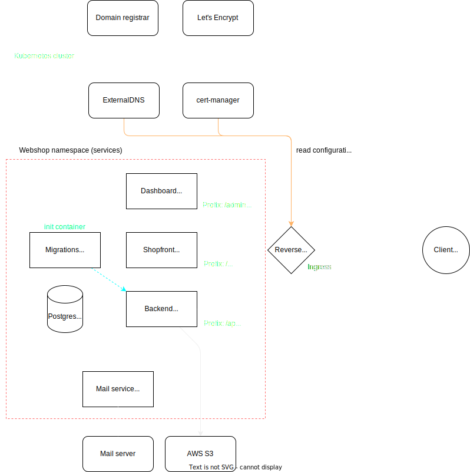

<div align="center">
  
</div>
<br />
<p align="center">A webshop group project for the courses IDATA2301 and IDATA2306 at NTNU</p>

<div align="center">
  <a href="#getting-started">Getting started</a> •
  <a href="https://cgg.datasnok.cool/">View demo</a> •
  <a href="#license">License</a>
</div>

## Table of contents

- [Project structure](#project-structure)
- [Architecture](#architecture)
- [Useful resources](#useful-resources)
- [Getting started](#getting-started)
  - [Environment variables](#environment-variables)
  - [Development](#development)
  - [Running tests](#running-tests)
  - [Deployment](#deployment)
- [License](#license)


## Project structure

```
├───apps
│   ├───backend (Spring Boot backend)
│   ├───storefront (customer-facing frontend)
│   ├───dashboard (admin frontend)
│   └───mail (mail microservice)
└───packages
    ├───contracts (DTOs - shared between frontends and backend, including validation)
    ├───migrations (Liquibase database migrations)
    └───ui (shared UI components & configuration)
```

The frontend is split in two as noted above, the reason why this is done is because the layout and functionality of the two are quite different. The storefront is a customer-facing webshop, while the dashboard is an admin panel for managing the webshop.

Any shared UI components are placed in the `ui` package. This helps avoid code duplication.

Migrations are split into it's own package, but is a development dependency for the backend. The motivation for splitting the migrations out from the backend is to allow for running them in a init container before the backend is started.

A diagram of the project structure can be found [here](docs/diagrams/project-structure.drawio.svg).

## Architecture

A high-level overview of the architecture is in the diagram below, and should depict how things are deployed in our production environment.


<div align="center">
  
</div>


It assumed that the application is going to be deployed as a set of containers to a Kubernetes cluster, however running it within any other container orchestration system should be possible. The reverse proxy part would have to be swapped out with an equivalent solution for the chosen system. Further details can be found under [Deployment](#deployment).


## Useful resources

Some internal resources you may find useful:

- [Architecture diagram](docs/diagrams/architecture.drawio.svg)
- [Project structure diagram](docs/diagrams/project-structure.drawio.svg)
- [Release workflow](docs/RELEASE.md)
- [ER diagram](docs/diagrams/erdiagramv2.drawio.svg)
- [Use cases](docs/diagrams/use-cases.drawio.svg)
- [API documentation](https://cgg.datasnok.cool/api/swagger-ui/index.html)
- [Wireframe](https://www.figma.com/file/Ncex2OIvg9kFG4ShYLDBpi/Webshop?type=design&node-id=0%3A1&t=y58tj1vW4rVKZ0YY-1)

## Getting started

- [Environment variables](#environment-variables)
- [Development](#development)
- [Running tests](#running-tests)
- [Deployment](#deployment)


### Environment variables

#### Backend environment variables

The variables marked as required are necessary for the backend to be able to start.

| Variable                      | Description                                                              | Required |
| ----------------------------- | ------------------------------------------------------------------------ | -------- |
| `POSTGRES_HOST`               | address of the database server                                           | yes      |
| `POSTGRES_PORT`               | port of the database server                                              | yes      |
| `POSTGRES_DB`                 | name of the database to connect to                                       | yes      |
| `POSTGRES_USER`               | database username                                                        | yes      |
| `POSTGRES_PASSWORD`           | database password                                                        | yes      |
| `TOKEN_ISSUER`                | JWT token issuer, (iss claim in token)                                   | yes      |
| `ACCESS_TOKEN_SECRET`         | secret used to sign access tokens                                        | yes      |
| `REFRESH_TOKEN_SECRET`        | secret used to sign refresh tokens                                       | yes      |
| `ACCESS_TOKEN_EXPIRATION_MS`  | expiration time for access tokens in milliseconds, defaults to 1 hour    |          |
| `REFRESH_TOKEN_EXPIRATION_MS` | expiration time for refresh tokens in milliseconds, defaults to 24 hours |          |
| `S3_ACCESS_KEY`               | access key used to access AWS S3                                         |          |
| `S3_SECRET_ACCESS_KEY`        | secret access key used to access AWS S3                                  |          |
| `S3_REGION_NAME`              | name of the region to use for S3                                         |          |
| `S3_BUCKET_NAME`              | name of the S3 bucket to use                                             |          |
| `MAIL_SERVICE_ENABLED`        | set to `true` to enable the mail service, defaults to false              |          |
| `MAIL_SERVICE_HOST`           | the host of the mail service, defaults to localhost                      |          |
| `MAIL_SERVICE_PORT`           | the port of the mail service, defaults to 4000                           |          |

#### Mail service environment variables

The variables marked as required are necessary for the mail service to be able to start.

| Variable               | Description                                                  | Required |
| ---------------------- | ------------------------------------------------------------ | -------- |
| `MAIL_SERVER_HOSTNAME` | hostname of the mail server                                  | yes      |
| `MAIL_SERVER_PORT`     | port of the mail server                                      | yes      |
| `MAIL_USERNAME`        | username for the mail server                                 | yes      |
| `MAIL_PASSWORD`        | password for the mail server                                 | yes      |
| `MAIL_SENDER`          | email address to send emails from                            | yes      |
| `HOSTNAME`             | hostname of the webshop ui, used to link to the UI in emails | yes      |

### Development

In order to get started with development, you will need the following:

- Java 17 (LTS)
- Docker
- PNPM
- Node.js 18 (LTS)
- Environment variables defined, refer to [the section above](#environment-variables) and [.env.example](.env.example)

With those installed, you can:

1. Clone the repository using your preferred method

2. Set up a run/debug config if necessary:

   `no.ntnu.webshop.WebshopApplication` as the entry point for the backend

   `no.ntnu.webshop.migrations.MigrationsApplication` as the entry point to run migrations

   A default launch.json is already provided for VSCode.

3. Start the docker container by running `docker compose up -d`

4. Start the backend through your IDE

   Alternatively you can start the Java apps using `gradlew` from the command line using the following commands from the root of the project.

   ```bash
   ./gradlew :apps:backend:bootRun
   ./gradlew :packages:migrations:bootRun
   ```

5. Install the PNPM dependencies by running `pnpm install` in the root of the project

6. Start the frontend by running `pnpm --filter @webshop/storefront dev`

Once completed, you can access the frontend at the URL shown in the terminal.

The last step also applies for starting `dashboard` and `mail` as well, just replace `storefront` with the name of the package you want to start.

### Running tests

<details>

<summary>In case you are using VS Code, expand and read this note</summary>

Add the following to your `settings.json` to enable running tests from VS Code:

```json
{
  "java.test.config": [
    {
      "name": "local",
      "workingDirectory": "${workspaceFolder}",
      "env": {
        "spring.config.location": "${workspaceFolder}/apps/backend/src/test/resources/"
      }
    }
  ]
}
```

</details>

In order to run tests, you need to have Docker installed. Our tests rely on [Testcontainers](https://www.testcontainers.org/), which automagically starts a Postgres container instance that it will use for the tests.

Once you have everything set up, run the tests from your editor or through `./gradlew :apps:backend:test`.

### Deployment

Our own environments are defined in GitHub and deployed from GitHub Actions using [this workflow](.github/workflows/release.yml) and [this re-usable action script](.github/actions/deploy-stack/action.yml). The environments are namespaces in a Kubernetes cluster, and uses our own [Helm chart](.helm/) to template the deployment. The following assumptions are made about the configuration in the cluster:

- ClusterIssuer for TLS certificates
- ExternalDNS for setting up DNS records (optional)
- Storage provisioner for the persistent volume claims

If you wish to run the stack using Docker Compose, you can use the [docker-compose.prod.yml](docker-compose.prod.yml) file. For HTTPS to work, you will have to modify the commented out segments of the Traefik reverse proxy service.

## License

Distributed under the [MIT License](LICENSE).

