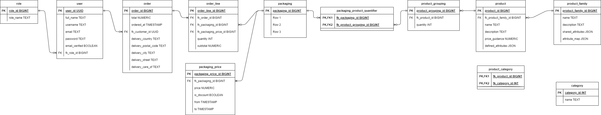

# Sprint 1

## Sprint review

### Goals for this sprint
🎯 Sketch first draft of ER diagram

🎯 Sketch first draft of design guidelines based on project theme

### What goals were accomplished this sprint?
✅ Sketch first draft of ER diagram

✅ Sketch first draft of design guidelines based on project theme

### Artifacts

## Sprint retrospective

### What would we do differently?
No comment.

### What should we keep doing?
No comment.

### What went well?
No comment.

### What can be improved?
No comment.
