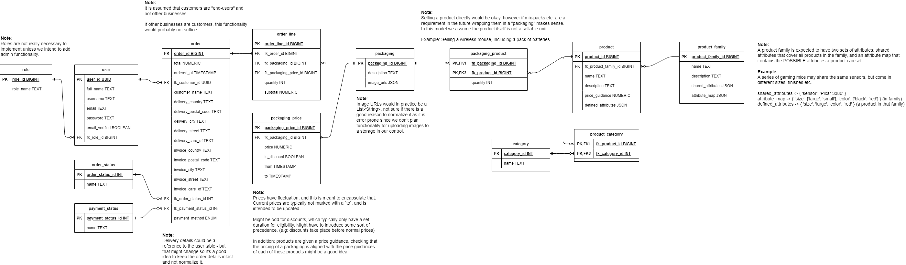

# Sprint 2

## Sprint review

### Goals for this sprint
🎯 Sketch general UI layout as wireframe in Figma

🎯 Set up Spring Boot project

🎯 Expand on design guidelines

🎯 Finalize first version of the ER diagram

🎯 Create a simple wordmark or logo

🎯 Set up React project

### What goals were accomplished this sprint?
✅ Sketch general UI layout as wireframe in Figma

✅ Set up Spring Boot project

✅ Expand on design guidelines

✅ Finalize first version of the ER diagram

✅ Create a simple wordmark or logo

✅ Set up React project

### Optional: Artifacts

## Sprint retrospective

### What would we do differently?
No comment.

### What should we keep doing?
- Keep working during lab sessions

### What went well?
- Managed to finish all planned issues
- Logo creation

### What can be improved?
No comment.