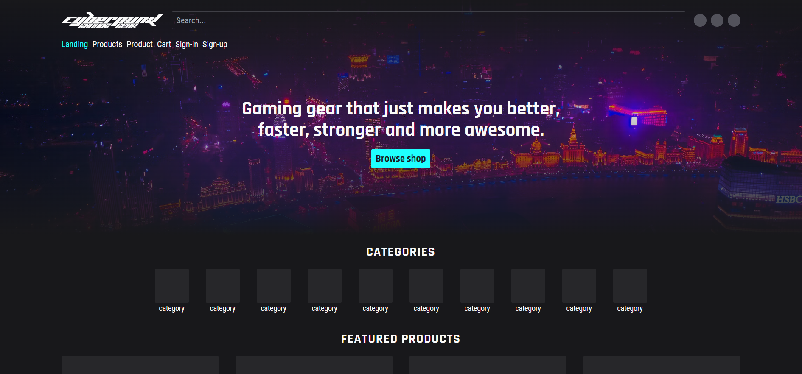

# Sprint 3

## Sprint review

### Goals for this sprint
🎯 Go through checklist for design guidelines

🎯 Set up page structures

🎯 Scaffold dashboard React project

🎯 Set up shared UI package

🎯 Sketch architectural diagram

### What goals were accomplished this sprint?
✅ Go through checklist for design guidelines

✅ Set up page structures (not all, but the ones defined in the issue on gh)

✅ Scaffold dashboard React project

✅ Set up shared UI package

✅ Sketch architectural diagram

### What extra has been done this sprint?
Sign-in & sign-up page

### Artifacts

## Sprint retrospective

### What would we do differently?
- Could create slightly more detailed issues to prevent confusion

### What should we keep doing?
- Keep working during lab sessions

### What went well?
- Managed to finish all planned issues

### What can be improved?
No comment.