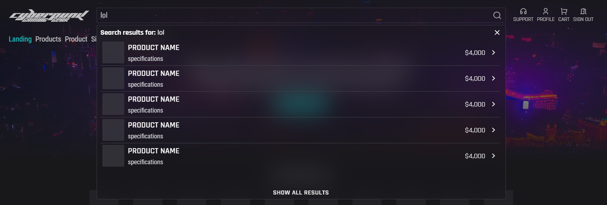
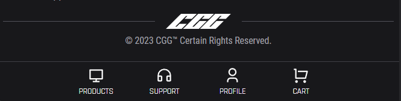

# Sprint 6

## Sprint review

### Goals for this sprint
🎯 Split out Liquibase migrations to a separate package

🎯 Prototype frontend effects

🎯 Implement more functionality in header

🎯 Wire up navigation to elements

🎯 Create a functional mockup of the search bar overlay

🎯 Finish mapping entities in the backend

🎯 Create navigation bar for mobile

🎯 Define migrations for entities based off diagram

🎯 Make resizing script support directories (recursively)

🎯 Create a simple TextInput component

### What goals were accomplished this sprint?
✅ Split out Liquibase migrations to a separate package

✅ Prototype frontend effects

✅ Implement more functionality in header

✅ Wire up navigation to elements

✅ Create a functional mockup of the search bar overlay

✅ Finish mapping entities in the backend

✅ Create navigation bar for mobile

✅ Define migrations for entities based off diagram

✅ Make resizing script support directories (recursively)

🔄️ Create a simple TextInput component

### What extra has been done this sprint?
- Support page
- 404 page
- Update terminology and refactor according to the new ER-diagram (renaming product to item, packaging to product)

### Artifacts

## Sprint retrospective

### What would we do differently?
No comment.

### What should we keep doing?
- Keep working during lab sessions

### What went well?
- Managed to finish most planned issues

### What can be improved?
No comment.
