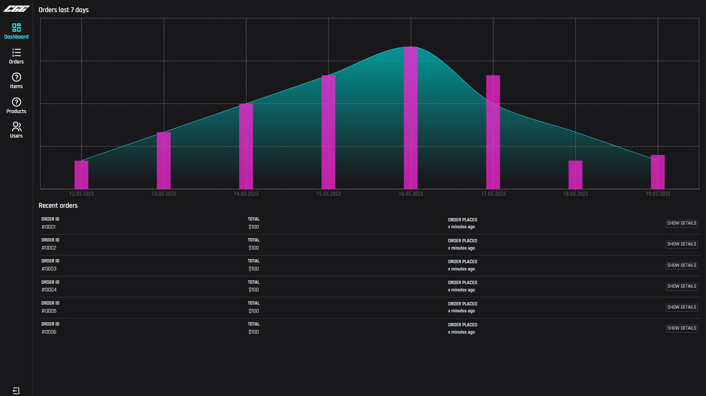

# Sprint 8

## Sprint review

### Goals for this sprint

🎯 Backend: Set up endpoint and contract for listing products

🎯 Storefront: Make all pages adhere to sketched mobile versions

🎯 Storefront: Integrate product browser with backend

🎯 Storefront: Integrate product view with backend

🎯 Backend: Set up endpoint and contract for retrieving categories

🎯 Storefront: Add authentication checks to the frontend

🎯 Storefront: Store authentication state in the store

🎯 Backend: Set up endpoint and contract for retrieving a single product

🎯 Backend: Set up endpoint and contract for defining products

🎯 Backend: Set up endpoint and contract for retrieving a users profile

🎯 Storefront: Add error state to text field component and an error label component

### What goals were accomplished this sprint?
✅ Backend: Set up endpoint and contract for listing products

✅ Storefront: Make all pages adhere to sketched mobile versions

✅ Storefront: Integrate product browser with backend

✅ Storefront: Integrate product view with backend

✅ Backend: Set up endpoint and contract for retrieving categories

✅ Storefront: Add authentication checks to the frontend

✅ Storefront: Store authentication state in the store

✅ Backend: Set up endpoint and contract for retrieving a single product

✅ Backend: Set up endpoint and contract for defining products

✅ Backend: Set up endpoint and contract for retrieving a users profile

🔄️ Storefront: Add error state to text field component and an error label component

### What extra has been done this sprint?
- Dashboard mockup
- Redesigned checkout page

### Artifacts
 

## Sprint retrospective

### What would we do differently?
No comment.

### What should we keep doing?
- Keep working during lab sessions

### What went well?
- Managed to finish most planned issues

### What can be improved?
No comment.
